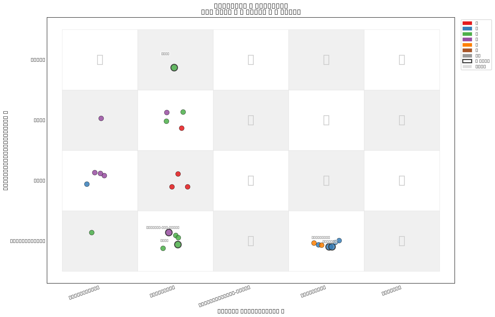
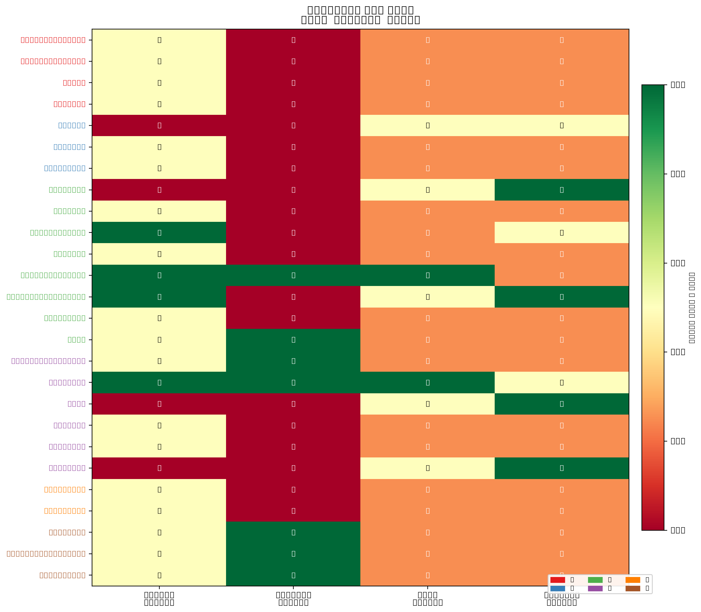

# 综合分析：双轴矩阵定位 + 部署就绪度

> 文献综述章节 · 核心章 · 暴露空白 → 推导议程

---

## 9.1 双轴矩阵总体分布

图 1 将 48 篇精读论文按双轴（横轴 = 补偿目标，纵轴 = 健全性代价）定位。每个点代表一篇论文，颜色表示子方向，★ 标记为必引锚点，？标记为空白区域。

**图 1**：双轴矩阵散点图。横轴 = LLM 补偿静态分析的五个短板（A=调用图不完整，B=模式不精确，C=污点规范缺失，D=版本-可达性鸿沟，E=数据与标注质量）。纵轴 = 对健全性的代价（1=只剪误报可能引入漏报，2=只补漏报，3=声称两者兼顾，4=零漏报保证）。

### 关键观察

**观察 1：论文高度集中于横轴 B（模式不精确/误报消减）和纵轴 1（只剪误报）。**
方向③（LLM 消减误报）的 11 篇论文中，10 篇定位在"只剪误报"层。这意味着绝大多数 LLM 误报消减工作**未量化其引入的漏报风险**。例外是保守分析（D3●）和 LLM4PFA（Z3 兜底）。

**观察 2：纵轴顶部（零漏报保证）几乎空白。**
48 篇论文中仅 2 篇（保守分析、LLM4PFA）提供接近"零漏报保证"的设计。Sifting the Noise 是唯一系统量化了漏报代价的论文（FN 22.25%），但未解决它。

**观察 3：横轴 A（调用图不完整/可达性）与纵轴 4（零漏报保证）的交叉点完全空白。**
这意味着没有任何工作同时解决"调用图动态分发断裂"和"保证不引入新漏报"——这是议程 1 的直接证据。

**观察 4：D1● + D2● + D3● 三元组合从未同篇出现。**
SemTaint（D1●，动态分发）用 GPT-5 云端模型；Bridging（D2●，<4B 离线）不做动态分发；保守分析（D3●，零漏报）不做可达性。三者在技术上都可以组合，但无人做过。

---

## 9.2 部署就绪度总体评估

**图 2**：部署就绪度热力图。四维度：可编译性要求（越低越好）、云端大模型依赖（越低越好）、可解释性（越高越好）、真实代码库验证（越高越好）。✓ = 满足，? = 未知/部分，✗ = 不满足。

### 关键发现

**发现 1：云端大模型依赖是普遍瓶颈。**
48 篇中仅 5 篇（Bridging <4B、SecureFixAgent <8B、SAST-Genius Llama 3 8B、Boosting-Pointer Qwen3-14B、AndroByte Gemma3）使用了可在消费级硬件运行的本地模型。其余全部依赖 GPT-4/5 级云端 API——这在离线/气隙/等保场景下不可部署。

**发现 2：可解释性整体薄弱。**
大多数论文的 LLM 判定为黑箱输出，不提供结构化证据链。仅保守分析（D5◐）、VulAgent（D5◐）、Sifting（D5◐）等少数工作试图输出判定理由——但都是自由文本，无法自动审计验证。

**发现 3：真实代码库验证覆盖率尚可但集中于少数方向。**
方向⑤（Agent）和方向②（SCA）有较好的真实代码验证；方向③（误报消减）大量依赖合成基准（OWASP Benchmark/Juliet），与真实代码的 FPR 差异显著。

---

## 9.3 空白区域矩阵

以下表格总结了双轴矩阵中的关键空白区域及其对应的研究议程。

| 矩阵空白 | 描述 | 严重程度 | → 议程 |
|---------|------|:---:|:---:|
| **(A,4) 空白** | 调用图断裂补偿 + 零漏报保证 | 🔴 最高 | 议程 1 |
| **(all, D2) 稀疏** | 离线/小模型覆盖严重不足 | 🔴 高 | 议程 2 |
| **(all, 无 FN 报告)** | 健全性代价无系统量化 | 🔴 高 | 议程 3 |
| **横轴 A 缺 Java** | D1● (SemTaint) 仅限 JS，无 Java | 🟡 中 | 议程 4 |
| **纵轴 4 缺可解释** | 零漏报方案无结构化证据链 | 🟡 中 | 议程 5 |

---

## 9.4 跨方向主题

**主题 1："静态找候选 + LLM 判语义"混合架构已成共识。**
48 篇中 32 篇（67%）采用此范式——从 VERCATION 到 IRIS 到 SemTaint 到 Sifting。纯 LLM 检测（早期路线）已被实证否决（ProjectScale: Java 召回 34%, FDR 85%）。

**主题 2：从语法相似走向语义相似。**
SCA 方向的演进轨迹清晰：V0Finder（函数哈希）→ V-SZZ（编辑距离）→ VERCATION（AST 语义）→ SAVANT（LLM 语义可达性）。语法方法的天花板已经被反复证实。

**主题 3：数据/标注不可靠是系统性瓶颈。**
Croft（20-71% 标签不准）、CleanVul（40-75% 噪音）、MSIVD（严重数据泄露）共同揭示：该领域的数据质量不足以支撑可靠评估。

**主题 4：Agent 范式偏离可达性判定。**
方向⑤ 的 D4 繁荣（动态执行验证成标配）值得肯定，但 Agent 的目标是"可 exploit 吗"而非"可 reach 吗"——前者对漏洞利用研究有用，后者对 SCA 误报消减有用。两个目标不同，方法论也不通用。

---

## 9.5 从空白到议程

上述矩阵分析揭示了 5 个具体可操作的空白。这些空白不是"某篇论文没做某件事"的琐碎缺陷，而是**系统性、跨方向的、有清晰技术路线的研究机会**。下一章（§10）将每个空白展开为一条具体的研究议程——包括问题定义、技术路线、关键挑战、评测方案和预期影响。
